# Texas School Choice Website - Site Map

## Overview
The Texas School Choice website is a single-page application designed to guide parents through understanding and accessing school choice options in Texas. The site follows a narrative flow that takes visitors from problem awareness to actionable next steps.

## Site Structure

```mermaid
graph TB
    A[Texas School Choice Homepage]
    A --> B[Hero Section - Header]
    A --> C[Navigation Menu - Future Use]
    
    B --> B1[Education Revolution Theme]
    B --> B2[Key Statistics Display]
    B --> B3[Hero CTA - Discover the Change]
    
    D[#problem - The Problem]
    A --> D
    D --> D1[Broken System Overview]
    D --> D2[Problem Grid - 4 Pain Points]
    D --> D3[Parent Testimonials - Problems]
    
    E[#solution - The Solution]
    A --> E
    E --> E1[Political Breakthrough]
    E --> E2[ESA Program Details]
    E --> E3[Eligibility Information]
    E --> E4[Process Steps]
    E --> E5[Social Proof from Other States]
    E --> E6[Dream Scenarios]
    E --> E7[Realistic Expectations]
    
    F[#benefits - Benefits]
    A --> F
    F --> F1[Life-Changing Benefits]
    F --> F2[4 Major Benefit Categories]
    F --> F3[Texas School Examples]
    F --> F4[Transformation Stories]
    
    G[#proof - Proof]
    A --> G
    G --> G1[Real Data Statistics]
    G --> G2[Success Testimonials]
    G --> G3[Texas Charter School Results]
    G --> G4[Research Backing]
    
    I[#financial - Financial Section]
    A --> I
    I --> I1[ESA Breakdown]
    I --> I2[Funding Tiers]
    I --> I3[How to Get Funding]
    
    J[#school-options - School Options]
    A --> J
    J --> J1[6 Education Options Grid]
    
    H[#action - Take Action]
    A --> H
    H --> H1[3-Step Action Process]
    H --> H2[Calculate Benefits]
    H --> H3[Research Schools]
    H --> H4[Connect with Parents]
    
    K[Contact Modal - Popup]
    A --> K
    K --> K1[Planning Guide Form]
    
    L[Footer]
    A --> L
    L --> L1[Copyright & Legal Info]
    
    style A fill:#f9f,stroke:#333,stroke-width:4px
    style C fill:#bbf,stroke:#333,stroke-width:2px,stroke-dasharray: 5 5
    style D fill:#fbb,stroke:#333,stroke-width:2px
    style E fill:#bfb,stroke:#333,stroke-width:2px
    style F fill:#fbf,stroke:#333,stroke-width:2px
    style G fill:#bff,stroke:#333,stroke-width:2px
    style I fill:#ffb,stroke:#333,stroke-width:2px
    style J fill:#ffd,stroke:#333,stroke-width:2px
    style H fill:#bdf,stroke:#333,stroke-width:2px
```



## Section Details

### 1. Hero Section (Landing Area)
- Education revolution messaging
- Key statistics: $1B investment, 100K+ students, May 3, 2025 signing
- Primary call-to-action leading to Problem section

### 2. Problem Section (#problem)
- Overview of the broken education system
- 4 major pain points with emotional hooks
- Real Texas district data (Houston ISD, Dallas ISD, Plano, Frisco)
- Parent testimonials showing current struggles

### 3. Solution Section (#solution)
- Introduction to Texas ESA program
- Eligibility phases (2026-2027)
- Application process breakdown
- Success stories from Arizona and Florida
- Dream scenarios for families
- Realistic expectations setting

### 4. Benefits Section (#benefits)
- 4 key benefit categories
- Real Texas school examples (IDEA, BASIS, Great Hearts, KIPP)
- Parent transformation stories
- Specific outcomes and results

### 5. Proof Section (#proof)
- Key statistics: 99% program support, achievement gains, satisfaction rates
- Success testimonials from Texas families
- Texas charter school performance data
- Research backing from Harvard, Brookings, and other institutions

### 6. Financial Section (#financial)
- ESA funding breakdown ($10,330 standard, up to $40K special needs)
- Eligibility requirements
- 4-step application process

### 7. School Options Section (#school-options)
- 6 education choices grid:
  - Traditional public schools
  - Charter schools
  - Private schools
  - Online schools
  - Homeschooling
  - Microschools

### 8. Action Section (#action)
- 3-step process:
  1. Calculate your benefits
  2. Research schools
  3. Connect with other parents
- Clear next steps for parents

### 9. Contact Modal (Popup Form)
- Lead capture form
- Planning guide offer

### 10. Footer
- Copyright and legal information

## Technical Implementation
- **Architecture**: Single HTML file with section-based structure
- **Navigation**: Smooth scroll navigation via JavaScript
- **Responsive Design**: Mobile-friendly with hamburger menu
- **Interactive Elements**: Modal functionality for lead capture
- **Animations**: Intersection Observer for scroll-triggered animations
- **Accessibility**: ARIA labels and semantic HTML throughout

## User Journey Flow
The site follows a carefully crafted narrative structure:

```
Hero → Problem (Pain) → Solution (Hope) → Benefits (Vision) → Proof (Credibility) → Financial (Details) → Options (Choices) → Action (Next Steps)
```

This progression is designed to convert skeptical parents into informed advocates by taking them through an emotional journey backed by factual data and local Texas examples.